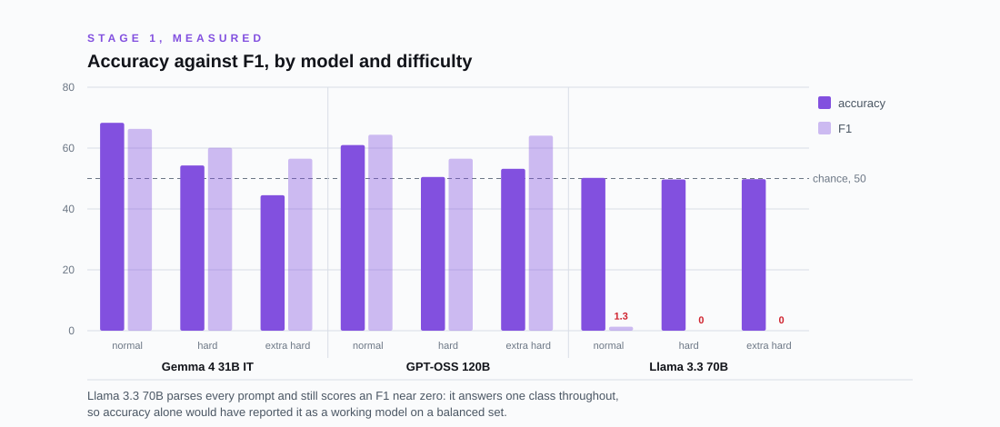
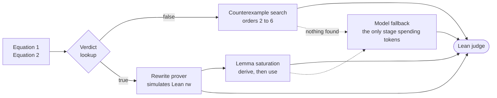

<div align="center">

<br>

# SAIR Mathematics Distillation Challenge

**Equational Theories, Stage 1 and Stage 2, worked end to end.**

<br>

Two questions, one repository. Can mathematical reasoning be compressed into
a page a language model reads before it answers? And can the answer be made
to carry a proof a machine will check, rather than a claim a human has to
trust?

<br>

[Stage 1](stage1/README.md) &nbsp;·&nbsp;
[Stage 2](stage2/README.md) &nbsp;·&nbsp;
[Solvers](stage2/solvers/README.md) &nbsp;·&nbsp;
[Competition](https://competition.sair.foundation/competitions/mathematics-distillation-challenge-equational-theories-stage2/overview) &nbsp;·&nbsp;
[Discussions](https://github.com/Amey-Thakur/SAIR-MATHEMATICS-DISTILLATION-CHALLENGE/discussions)

<br>

[](https://github.com/Amey-Thakur/SAIR-MATHEMATICS-DISTILLATION-CHALLENGE/actions/workflows/ci.yml)
[](https://competition.sair.foundation/competitions/mathematics-distillation-challenge-equational-theories-stage2/overview)
[](https://lean-lang.org/)
[](https://github.com/Amey-Thakur)
[](https://orcid.org/0000-0001-5644-1575)
[](LICENSE)

<br>



</div>

---

## The problem

A **magma** is the least structured object in algebra: a set with one binary
operation `◇` and no other rules. No associativity, no identity, no inverses.
Because so little is assumed, a law such as `x = x ◇ y` constrains a magma
only lightly, and working out what else it forces is genuinely difficult.

The [Equational Theories Project](https://github.com/teorth/equational_theories)
took the 4,694 simplest such laws and asked, for every ordered pair, whether
the first implies the second. That is 22,033,636 questions, settled in Lean 4
through a mix of automated search and human proof.

This competition asks a different question about the same material:

> Can strong mathematical reasoning be distilled into a compact artefact that
> makes a language model better at a formal task?

The setup follows Honda, Murakami and Zhang (2025), *Distilling Many-Shot
In-Context Learning into a Cheat Sheet*. The difference here is that the
artefact is discovered by open competition rather than produced by a single
model query.

It is organised by **Damek Davis** (Associate Professor of Statistics and Data
Science, University of Pennsylvania), **Terence Tao** (Professor at UCLA and
co-founder of the SAIR Foundation), and the SAIR Foundation. Stage 1 launched
on 14 March 2026 at 15:09:26 UTC+14, the earliest place on Earth to reach
3.1415926.

## Why it is hard

The obvious approach fails in an instructive way.

Ask a model whether `x = x ◇ y` implies `x = x ◇ x` and it will answer. On a
balanced set of true and false problems it will also be right about half the
time, which is the accuracy of a coin. Two of the three Stage 1 evaluation
models sat close to that line, and one of them got there in the worst way, by
answering a single class for every problem it saw.

<div align="center">



</div>

Accuracy alone would have reported that model as working. F1 shows what it
actually did. A cheatsheet that lifts accuracy on a balanced set has to move
both numbers, and that is the whole difficulty of Stage 1.

Stage 2 removes the escape route. An answer is worth nothing unless it arrives
with a certificate.

## Stage 1: the cheatsheet

**Submit a complete prompt.** The template and the cheatsheet text together,
at most 10 KB, exactly as it will be sent. The model answers true or false,
and only correctness is scored.

The evaluation set is balanced, held back from the 1,669 public problems, and
run offline with no browser, no search and no retrieval. Three models score
with equal weight: OpenAI GPT-OSS-120B, Meta Llama-3.3-70B-Instruct and Google
Gemma-4-31B-IT.

Everything from that stage is kept in **[stage1/](stage1/README.md)**: the
prompt, the cheatsheet, the problem-set analysis, and the measured scores.

## Stage 2: the certificate

**Submit a solver.** One `solver.py`, at most 500 KB, which for each pair of
equations must produce a Lean 4 certificate.

| Verdict | What has to be produced |
| --- | --- |
| **True** | A Lean 4 proof that the hypothesis forces the goal in every magma |
| **False** | A magma where the hypothesis holds and the goal fails, as a Lean term the judge evaluates |

A deterministic Lean judge accepts or rejects. There is no partial credit and
no probabilistic scoring. The solver runs inside `python:3.12-slim` on two
cores with 2 GB of memory, no network, a read-only filesystem, and no
third-party packages. A solver that imports `numpy` does not degrade, it dies
on import and loses every answer.

Two tracks share that one file.

| Track | Shape | Budget |
| --- | --- | --- |
| **Solo** | One problem per subprocess, JSON over stdin and stdout, interactive judge feedback | Fixed, per problem |
| **Marathon** | N problems per subprocess (reference N = 100), manifest in, append-only JSONL out | Shared: N × 5 minutes and N × 32,768 tokens |

## How this repository answers it

The obvious solver asks a model to write the Lean proof and hopes the judge
agrees. Model-written Lean is wrong often enough that a large share of answers
come back rejected, and every one of them has already been paid for in tokens.

The solver here inverts the order. It proves what it can without the model,
and each deterministic answer is correct before it is ever sent.



Four properties make it work, and each one answers something that went wrong
first.

1. **Counterexamples are cheap and certain.** Orders 2 and 3 exhaustively,
   affine magmas up to order 8, order 4 by constrained backtracking, and
   filtered random tables at orders 5 and 6. Every witness is verified in
   Python before it is emitted, so the judge only confirms a fact already
   established. No tokens are spent.
2. **Some true implications need no model either.** If the hypothesis forces
   every element equal, one line closes any goal. Beyond that, a rewrite
   prover simulates Lean's `rw` exactly and searches short chains of
   hypothesis instances in both directions, and a lemma saturation pass
   derives helper laws and proves them before using them.
3. **The verdict is known before the search starts.** The Equational Theories
   outcome matrix is embedded in the solver, compressed to about 32 KB by
   collapsing 4,694 equations into 1,415 classes with identical implication
   behaviour. It steers the budget only. A table miss can never emit a wrong
   answer, because certificates are still verified locally.
4. **The model is the last resort, not the first.** It is called only for true
   implications that resisted every deterministic stage, with a structural
   prompt and a ban list applied to whatever comes back.

On the official 20-problem sample the deterministic stages alone answer 15,
with no tokens spent and no incorrect certificate produced.

## What is where

| Path | What it holds |
| --- | --- |
| **[stage1/](stage1/README.md)** | The finished cheatsheet stage: prompt, cheatsheet, problem-set analysis, scoring scripts, source datasets |
| **[stage2/](stage2/README.md)** | The certificate stage: architecture, research notes, and the sandbox gate |
| **[stage2/solvers/](stage2/solvers/README.md)** | The three solvers, which one to submit, and how to test against the real judge |
| [stage1/analysis/](stage1/analysis/) | What the problem sets contain and how the models fail on them |
| [stage1/sources/](stage1/sources/) | The Equational Theories Project, the benchmark, and the selected problem sets, at the revision used |
| [.github/](.github/) | The CI gate that holds the solver to the sandbox, and the figure generator |

## Run it yourself

The Lean judge is the only authority on whether a certificate is accepted, so
test against the official harness before submitting anything.

```bash
git clone https://github.com/SAIRcompetition/equational-theories-lean-stage2
cd equational-theories-lean-stage2
bash scripts/setup.sh
source .env.judge
python3 -m pipeline.runner --submission <this-repo>/stage2/solvers/hybrid --problems examples/problems/sample_20.json
```

Two checks run without any Lean toolchain at all.

```bash
python stage2/scripts/check_solver.py
```

```bash
python stage2/solvers/hybrid/verify_solver.py
```

The first holds the solver to the sandbox rules and the size cap. The second
re-parses every emitted certificate from its Lean source and re-verifies it.

The figures in this README are generated from the repository's own data.

```bash
python .github/assets/build_assets.py
```

## Reading further

- [Equational Theories Project](https://github.com/teorth/equational_theories), the Lean formalisation this is built on
- [Official Stage 2 pipeline](https://github.com/SAIRcompetition/equational-theories-lean-stage2), judge, demo solvers and tutorial
- [Stage 1 judge](https://github.com/SAIRcompetition/equational-theories-stage1-judge), evaluation configuration and local testing
- [Selected problems](https://huggingface.co/datasets/SAIRfoundation/equational-theories-selected-problems), the public sets on Hugging Face
- [SAIR Foundation Zulip](https://zulip.sair.foundation/), where the competitions are discussed

## Related work

- [SAIR Inverse Galois Problem (IGP24)](https://github.com/Amey-Thakur/SAIR-INVERSE-GALOIS-PROBLEM-IGP24)
- [SAIR Modular Arithmetic Challenge](https://github.com/Amey-Thakur/SAIR-MODULAR-ARITHMETIC-CHALLENGE)

---

<div align="center">

Prepared by **[Amey Thakur](https://github.com/Amey-Thakur)** &nbsp;·&nbsp;
ORCID [0000-0001-5644-1575](https://orcid.org/0000-0001-5644-1575)

<sub>Released under <a href="LICENSE">CC BY 4.0</a>, with citation metadata in <a href="CITATION.cff">CITATION.cff</a>.<br>
Material under <code>stage1/sources/</code> belongs to its original authors and keeps its own licence.<br>
Not affiliated with the SAIR Foundation. This is one participant's working repository.</sub>

</div>
