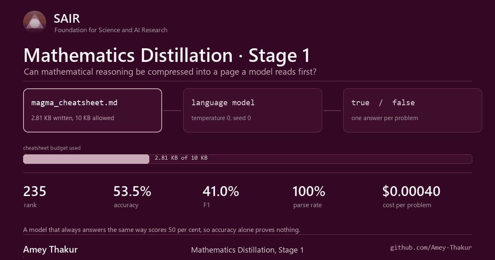

 
 

# Stage 1: the cheatsheet

**One page of distilled algebra, sent to a model before every question.**

[Back to the repository](../README.md) &nbsp;·&nbsp;
[Stage 2](../stage2/README.md) &nbsp;·&nbsp;
[Competition](https://competition.sair.foundation/competitions/mathematics-distillation-challenge-equational-theories-stage1/overview) &nbsp;·&nbsp;
[Leaderboard](https://competition.sair.foundation/competitions/mathematics-distillation-challenge-equational-theories-stage1/leaderboard)

---

## The result

Final standing on the scored evaluation leaderboard.

| | |
| --- | --- |
| Team | AVATAR, `EQT01-T00899` |
| Rank | 235 |
| Score | 2,889 |
| Accuracy | 53.5% |
| F1 | 41.0% |
| Parse rate | 100% |
| Cost per problem | $0.00040 |
| Cheatsheet size | 2.81 KB of the 10 KB allowed |

Read those two middle numbers together rather than separately. Accuracy of 53.5
per cent is barely above the coin, and an F1 of 41.0 says the cheatsheet was
guessing false more often than the set warranted. The parse rate is the only
clean number here: every answer came back in a form the judge could read.

Using less than a third of the size budget was not restraint. It was the honest
limit of what the distillation had to say.

## What was asked

Submit a **complete prompt**: the template and the cheatsheet text together,
at most 10 KB, exactly as it would be sent to the model. The model then
answers one question, over and over.

> Does Equation 1 imply Equation 2, for every magma?

Only correctness counted. No proof, no counterexample, no confidence.

The rules that shaped the work:

| Constraint | Value |
| --- | --- |
| Cheatsheet size | 10 KB, template and text together |
| Evaluation set | Balanced, half true and half false, held back from the public problems |
| Setting | Offline. No browser, no search, no retrieval |
| Models | GPT-OSS-120B, Llama-3.3-70B-Instruct, Gemma-4-31B-IT, equal weight |
| Public problems | 1,669 across `normal`, `hard1`, `hard2` and `hard3` |
| Closed | 20 April 2026, 23:59 AoE |

A balanced set is the detail that decides everything. It means a model that
answers the same way every time lands on 50 per cent accuracy and looks
half-competent, so accuracy on its own cannot tell a reasoner from a coin.

## What happened

Team AVATAR (`EQT01-T00899`) finished on 2,889 against an organiser baseline
of 2,853, at rank 235.

| Model | Set | Accuracy | F1 | Parse rate | Cost per problem |
| --- | --- | --- | --- | --- | --- |
| Gemma 4 31B IT | normal | 68.3% | 66.3% | 100.0% | $0.00059 |
| GPT-OSS 120B | normal | 61.0% | 64.4% | 100.0% | $0.00027 |
| Llama 3.3 70B | normal | 50.2% | 1.3% | 100.0% | $0.00031 |
| Gemma 4 31B IT | hard | 54.3% | 60.1% | 100.0% | $0.00057 |
| GPT-OSS 120B | hard | 50.5% | 56.5% | 100.0% | $0.00030 |
| Llama 3.3 70B | hard | 49.7% | 0.0% | 100.0% | $0.00031 |
| Gemma 4 31B IT | extra hard | 44.5% | 56.5% | 100.0% | $0.00067 |
| GPT-OSS 120B | extra hard | 53.2% | 64.1% | 100.0% | $0.00031 |
| Llama 3.3 70B | extra hard | 49.8% | 0.0% | 100.0% | $0.00031 |

Three readings worth keeping.

**Llama 3.3 70B parsed every prompt and reasoned about none of them.** A
100 per cent parse rate with an F1 of zero means the output was always
well-formed and always the same class. No cheatsheet fixes that, because the
model is not using it.

**The two working models fail differently.** Gemma is strongest on `normal`
and falls away as difficulty rises. GPT-OSS is flatter, and on `extra hard`
it passes Gemma. A single prompt tuned on `normal` therefore gives up ground
on the set where marks are hardest to find.

**Cost was never the binding constraint.** The recommended ceiling was one
cent per problem. Every run here came in two orders of magnitude below it, so
prompt length was limited by the 10 KB cap and by what the model could
actually use, not by budget.

## What is here

| Path | Contents |
| --- | --- |
| [prompts/](prompts/) | `complete_prompt.md` and its template, the artefact that was submitted |
| [cheatsheets/](cheatsheets/) | `magma_cheatsheet.md`, the distilled algebra, written against the 10 KB cap |
| [analysis/](analysis/) | [competition overview](analysis/competition_overview.md), [problem analysis](analysis/problem_analysis.md), [research notes](analysis/research.md) |
| [scripts/](scripts/) | `profile_datasets.py` to describe the problem sets, `process_runs.py` to mine the benchmark run logs |
| [sources/](sources/) | The Equational Theories Project, the benchmark, and the selected problem sets, kept at the revision used |

## Where it led

Stage 1 rewards a confident answer, and a model that is fluent and wrong
scores the same as one that is careful and wrong. Stage 2 removes that: an
answer counts only when it arrives with a certificate a machine will check.

The measurements above are the reason the Stage 2 solver puts deterministic
methods first and treats the model as a last resort.

**[Continue to Stage 2](../stage2/README.md)**
