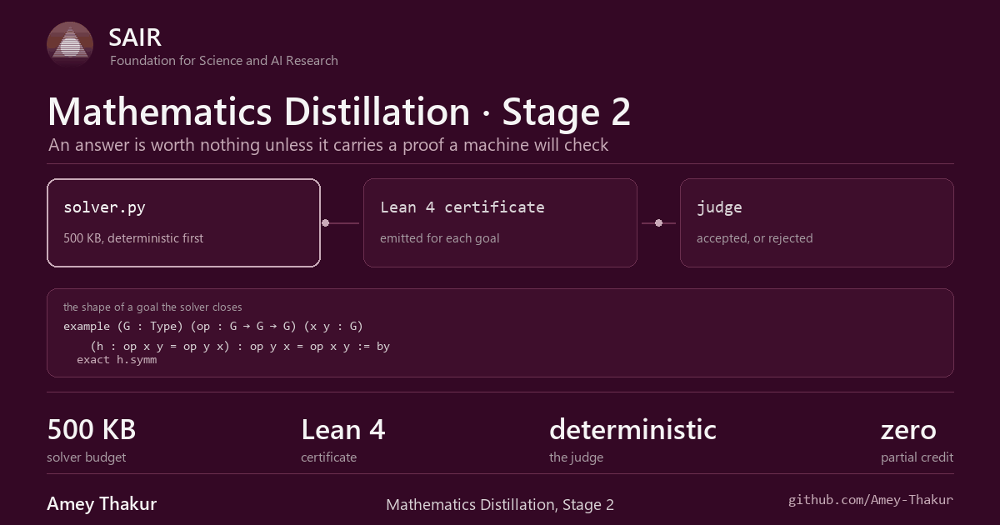
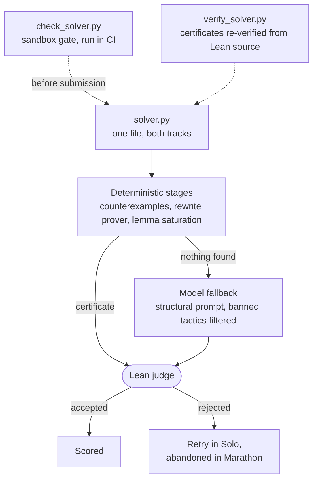

<div align="center">



<br>
<br>

# Stage 2: the certificate

**Every answer arrives with a proof a machine will check, or it does not count.**

[Back to the repository](../README.md) &nbsp;·&nbsp;
[Stage 1](../stage1/README.md) &nbsp;·&nbsp;
[Solvers](solvers/README.md) &nbsp;·&nbsp;
[Competition](https://competition.sair.foundation/competitions/mathematics-distillation-challenge-equational-theories-stage2/overview) &nbsp;·&nbsp;
[Official pipeline](https://github.com/SAIRcompetition/equational-theories-lean-stage2)

</div>

---

## What is asked

For each pair of equations, produce a Lean 4 certificate.

| Verdict | Certificate | Judge goal |
| --- | --- | --- |
| **True** | A proof that the hypothesis forces the goal in every magma | `∀ (G : Type) [Magma G], EquationLHS G → EquationRHS G` |
| **False** | A magma where the hypothesis holds and the goal fails | `∃ (G : Type) (_ : Magma G), EquationLHS G ∧ ¬ EquationRHS G` |

A deterministic Lean judge accepts or rejects. Nothing in between. A rejected
proof scores exactly what no answer scores, which is why a wrong certificate
is never worth sending.

## The rules that shape a solver

| Constraint | Value |
| --- | --- |
| Submission | One `solver.py`, at most 500 KB |
| Sandbox | `python:3.12-slim`, 2 vCPU, 2,048 MB, PIDs capped at 64 |
| Packages | Standard library only. No network. Read-only filesystem apart from a small `/tmp` |
| Judge | 300 seconds per call, certificate at most 100 KB, false witness at most 20 KB |
| Models | Google Gemma 4 31B, OpenAI gpt-oss-120b. Temperature 0, seed 0, 16,384 output tokens per call |
| Rejected tactics | `sorry`, `admit`, `#eval`, `#reduce`, `run_tac`, `macro`, `elab`, `unsafe`, `implemented_by`, `dbg_trace` |
| Closes | 31 August 2026, 23:59 AoE |

The package rule is the sharp one. A solver that imports `numpy` does not run
slowly or answer badly. It dies on import, before the first problem, and every
answer is lost. Nothing in a local run reveals that, because the packages are
installed locally, so it is checked in CI instead.

## Two tracks, one file

| Track | Shape | Budget |
| --- | --- | --- |
| **Solo** | One problem per subprocess. JSON over stdin and stdout, with judge feedback between attempts | Fixed, per problem |
| **Marathon** | N problems per subprocess, reference N = 100. Manifest JSONL in, append-only JSONL out | Shared: N × 5 minutes and N × 32,768 tokens |

The same `solver.py` serves both. It reads the environment: when
`JUDGE_MARATHON_MANIFEST` is set it runs Marathon, otherwise Solo. Marathon
counts only certificates already accepted when the budget ends, which rewards
answers that cost no tokens at all.

## How the pieces fit



## What is here

| Path | Contents |
| --- | --- |
| **[solvers/](solvers/README.md)** | The three solvers, which one to submit, and how to test against the real judge |
| [architecture.md](architecture.md) | The hybrid pipeline: what each stage decides and where the boundaries are |
| [research.md](research.md) | Judge behaviour, the Lean toolchain, the budget model, and the strategies that follow from them |
| [scripts/check_solver.py](scripts/check_solver.py) | Holds a solver to the sandbox rules and the size cap. Reads the source, never imports it |
| [solvers/hybrid/verify_solver.py](solvers/hybrid/verify_solver.py) | Re-parses every emitted certificate from its Lean source and re-verifies it in Python |
| [solvers/hybrid/EXPERIMENTS.md](solvers/hybrid/EXPERIMENTS.md) | What shipped, and what was tried and rejected by measurement |

## Testing before submitting

The judge is the only authority on acceptance, so run the official harness
first.

```bash
git clone https://github.com/SAIRcompetition/equational-theories-lean-stage2
cd equational-theories-lean-stage2
bash scripts/setup.sh
source .env.judge
python3 -m pipeline.runner --submission <this-repo>/stage2/solvers/hybrid --problems examples/problems/sample_20.json
```

Two checks need no Lean toolchain at all.

```bash
python scripts/check_solver.py
```

```bash
python solvers/hybrid/verify_solver.py
```

Submit only once both are clean and the harness accepts every deterministic
answer.

**[Read how the solvers work](solvers/README.md)**
