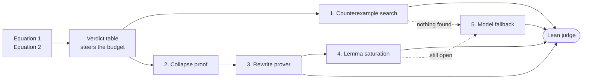

<div align="center">

# Stage 2 solvers

**Three solvers, one recommendation, and the reason it is not the obvious one.**

[Back to the repository](../../README.md) &nbsp;·&nbsp;
[Stage 2](../README.md) &nbsp;·&nbsp;
[Experiment ledger](hybrid/EXPERIMENTS.md) &nbsp;·&nbsp;
[Competition](https://competition.sair.foundation/competitions/mathematics-distillation-challenge-equational-theories-stage2/overview)

</div>

---

Submit one `solver.py`, at most 500 KB. Each track accepts up to two
submissions, and either model may be chosen.

| Solver | Approach | Tracks | Recommended |
| --- | --- | --- | --- |
| [`hybrid/`](hybrid/solver.py) | Deterministic first, model only as a last resort | Solo and Marathon | **Yes** |
| [`gpt_oss_120b/`](gpt_oss_120b/solver.py) | Model-led, gpt-oss-120b | Solo | Superseded |
| [`gemma_4_31b/`](gemma_4_31b/solver.py) | Model-led, gemma | Solo | Superseded |

## Why hybrid

The model-led solvers ask a language model to write the Lean 4 proof and then
hope the judge accepts it. Model-written Lean is wrong often enough that a
large share of answers come back rejected, and each one has already been paid
for in tokens.

`hybrid/solver.py` inverts that. It proves what it can without the model, and
every deterministic answer is correct by construction before it is sent.



1. **Counterexample search**, for a `false` verdict. Orders 2 and 3
   exhaustively, affine magmas `p a + q b + s mod n` up to order 8, order 4 by
   constrained backtracking, and hypothesis-filtered random tables at orders 5
   and 6. Every witness is verified in Python before it is sent, so the
   judge's `decideFin!` only confirms a fact already established. No tokens.
2. **Collapse proof**, for a `true` verdict. If the hypothesis forces every
   element equal, any goal follows from a one-line `all_eq` argument.
3. **Rewrite prover**, for a `true` verdict. Simulates Lean's `rw` exactly and
   searches short chains of hypothesis instances, forward and backward, that
   close the goal. The chain found ships verbatim as
   `intro ...; rw [h a b, ← h c d]`. No tokens.
4. **Lemma saturation**, for a `true` verdict that needs more than one step.
   Derives helper laws by applying the hypothesis to its own sides, proves
   each with the chain engine, and emits only the `have` blocks the final
   proof uses.
5. **Model fallback**, for a `true` verdict that resisted everything above.
   Only here is the model called, with a structural prompt and a ban list
   applied to what comes back. In Solo the judge error feeds the next round.
   In Marathon a single guarded attempt is made while the token budget allows.

On the official 20-problem sample the deterministic stages alone answer 15,
with no tokens spent and no incorrect certificate produced.

## The verdict table

The Equational Theories outcome matrix is embedded in the solver: 4,694
equations collapsed into 1,415 classes with identical implication behaviour,
stored as a two-bit class matrix and compressed to about 32 KB.

It **steers the budget only**. A known-false problem spends its time hunting a
counterexample rather than searching for a proof that does not exist, and a
known-true problem skips the hunt. A table miss, or an entry that disagrees
with reality, cannot produce a wrong answer, because certificates are still
verified locally before they are sent.

Problem sets number their equations locally, so the statement text is the
primary key and the identifier is only a checked fallback. That distinction
was found the hard way: id-keyed lookup was quietly feeding the table
unrelated laws.

## One file, both tracks

The same `solver.py` runs on either track. It reads the environment: when
`JUDGE_MARATHON_MANIFEST` is set it runs Marathon, with a manifest in, an
append-only JSONL out, and a shared token budget. Otherwise it runs Solo, with
JSON over stdin and stdout and interactive judge feedback.

Deterministic answers cost no tokens, which is what Marathon's compressed
budget rewards.

The Lean templates match the judge contract exactly.

```
true   Goal = forall (G : Type) [Magma G], EquationLHS G -> EquationRHS G
false  Goal = exists (G : Type) (_ : Magma G), EquationLHS G and not EquationRHS G
```

## Test it locally before submitting

The Lean judge decides acceptance, so run the official harness from the
[Stage 2 repository](https://github.com/SAIRcompetition/equational-theories-lean-stage2)
first.

```bash
bash scripts/setup.sh
source .env.judge
python3 -m pipeline.runner --submission <path>/stage2/solvers/hybrid --problems examples/problems/sample_20.json
```

```bash
python3 scripts/run_marathon_harness.py --submission <path>/stage2/solvers/hybrid --manifest examples/problems/marathon/normal_100.jsonl
```

Read `pipeline/results/` and confirm the deterministic answers are accepted.

Two checks run with no Lean toolchain at all.

```bash
python ../scripts/check_solver.py
```

```bash
python hybrid/verify_solver.py
```

The first holds the file to the sandbox rules and the size cap. The second
re-parses every emitted certificate from its Lean source and re-verifies it
exhaustively, checks the embedded verdict table against known answers, drives
both wire protocols against mock judges, and screens true proofs for banned
tactics.

## Submit

On the competition page choose the track and the model, then upload
`hybrid/solver.py`. The submission is that single file. Nothing else in this
folder is sent.

Re-posting to the same track updates the existing submission in place rather
than consuming a second slot, so iteration is free until the deadline.
